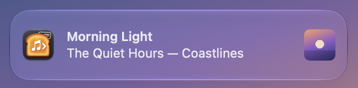
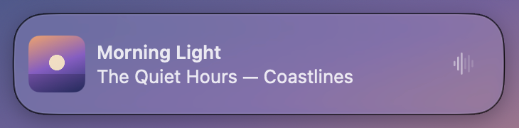

<p align="center"></p>

# Toastune

A menu bar app for macOS that shows a short alert when the song changes in Spotify or Apple Music.

Spotify's Mac app no longer shows song-change notifications, and Apple Music's built-in one is a plain system notification. Toastune covers both players with one alert that includes the album artwork, stays quiet while you skip through songs, and only announces songs (not podcasts or videos).

It only displays information. It never controls playback.

## Screenshots

Toastune offers two alert styles. Both show the same content.

**System Notification**: drawn by macOS through the UserNotifications framework.



**Floating Panel**: drawn by Toastune, sized and colored to match the system banner.



The track and artwork in the screenshots are made up.

## Choosing a style

| | System Notification | Floating Panel |
|---|---|---|
| Appearance | Drawn by macOS | Matches the system banner, drawn by Toastune |
| Permission | Needs notification permission | None |
| Focus and Do Not Disturb | Follows them | Not detected (see Limitations) |
| Full-screen apps | Follows system settings | Hidden while the front app is full screen |
| Artwork | Small thumbnail on the right | Large, on the left |
| Skipping several songs | Each shown song slides in as a new banner | Updates in place with a crossfade |
| Artwork that arrives late | Cannot be added after posting | Fades in |
| Time on screen | Set by macOS | 2, 3 or 5 seconds |

If notification permission is denied, the System Notification style falls back to the Floating Panel.

## Requirements

- macOS 14 or later. The Floating Panel uses Liquid Glass on macOS 26 and later.
- Spotify for Mac and/or the Music app.
- To build: Swift 6 and Xcode. Without full Xcode the build falls back to a prebuilt `.icns` icon.

## Install

### From a release

1. Download `Toastune.zip` from [Releases](../../releases) and unzip it.
2. Move `Toastune.app` to `/Applications`.
3. The app is not notarized. The first time, right-click it and choose **Open**, or run:

   ```sh
   xattr -dr com.apple.quarantine /Applications/Toastune.app
   ```

### From source

```sh
./scripts/build.sh
ditto .build/Toastune.app /Applications/Toastune.app
open /Applications/Toastune.app
```

`build.sh` signs ad hoc by default. With ad hoc signing, macOS may ask for the Automation and notification permissions again after every rebuild. To keep them, sign with your own identity:

```sh
SIGN_IDENTITY="Apple Development: Your Name (TEAMID)" ./scripts/build.sh
```

## Permissions

- **Automation** (Spotify, Music): needed to read the current song. macOS asks the first time Toastune reads each player. You can change it in System Settings › Privacy & Security › Automation.
- **Notifications**: only for the System Notification style.

## Menu

Toastune has no window. Click the toast icon in the menu bar.

- **Show Song Alerts**: turns alerts on or off.
- **Display Time**: 2, 3 or 5 seconds. Floating Panel only; macOS decides how long system notifications stay.
- **Alert Style**: System Notification or Floating Panel.
- **Show Player Icon**: off by default. In the Floating Panel, the Spotify or Music icon replaces the now-playing waveform on the right. In system notifications, it is used as the thumbnail when there is no artwork.
- **Quiet While Player Is in Front**: no alert while Spotify or Music is the frontmost app. Off by default.
- **Preview Alert**: shows an alert for the song that is playing now.

Clicking an alert brings the player to the front.

## Behavior

- The first song after launch is not announced. Pausing and resuming do not trigger an alert.
- Only songs are announced: Spotify `spotify:track` items and Music items whose media kind is song. Podcasts, videos and ads are ignored.
- When you skip through several songs quickly, only the one you stop on is announced, and artwork downloads for the skipped songs are cancelled.
- A new alert replaces the previous one. System notifications are removed from Notification Center about 8 seconds after delivery, so no history builds up.
- VoiceOver announces each song in the Floating Panel. Reduce Motion, Reduce Transparency and Increase Contrast are respected.

### Apple Music's own notification

Music has its own **When song changes** option in Music › Settings › General, and it is on by default. With both enabled, each song is announced twice. While Music is running with that option on, Toastune shows a reminder at the top of its menu.

## How it works

- **Detecting changes**: Spotify and Music post distributed notifications (`com.spotify.client.PlaybackStateChanged`, `com.apple.Music.playerInfo`) when playback changes. Each one triggers a single read of that player through its AppleScript dictionary, using the JavaScript for Automation scripts in `Sources/Toastune/Resources`. A read every 15 seconds catches anything missed. Scripts are compiled once and reused, and players that are not running are never contacted.
- **Artwork**: read once per song change, never while polling. Spotify's script returns an artwork URL, and Toastune downloads the 300 px version (about 20–30 KB). Music hands over the embedded artwork through AppleScript; songs without embedded artwork show a placeholder. Images are decoded straight to 160 px thumbnails and the last 24 are kept in memory.
- **Timing**: after a change Toastune waits 0.3 s (0.9 s if another change happened within 2 s) so skipped songs are not announced. Artwork loads during that wait. System notifications wait up to a further 0.7 s for artwork, because a posted notification cannot be updated.
- **Private APIs**: none. MediaRemote is not used.

On an idle Mac, Toastune used about 0.03 s of CPU time per 30 s and about 80 MB of memory in testing.

## Privacy

Song information stays on the Mac. The only network requests are artwork downloads from Spotify's image CDN (`i.scdn.co`). Nothing is logged or uploaded.

## Limitations

- **Focus**: the Floating Panel does not know about Focus or Do Not Disturb. macOS only exposes Focus status to apps with the Communication Notifications entitlement, which requires an App ID provisioned through a paid Apple Developer account. The System Notification style follows Focus because macOS handles it.
- **Screen sharing**: there is no public API to detect it, so the Floating Panel can appear while you share your screen.
- **Apple Music streaming tracks**: Music's scripting interface may not report songs that are not in your library, and some have no embedded artwork.
- **Icon changes**: Notification Center caches app icons and may keep showing an older Toastune icon after an update until the icon cache is cleared or the Mac restarts.
- The release build is not notarized.

## Development

```sh
swift test                     # track-change logic
./scripts/build.sh             # builds .build/Toastune.app
swift scripts/make-icon.swift  # regenerates icon assets from Design/AppIcon.png
```

| Path | Contents |
|---|---|
| `Sources/Toastune/MediaStream.swift` | Broadcast observers, fallback reads, compiled player scripts |
| `Sources/Toastune/TrackChanges.swift` | Decides which snapshots count as a song change |
| `Sources/Toastune/ArtworkLoader.swift` | Artwork fetching, downsampling and caching |
| `Sources/Toastune/SystemNotifier.swift` | System Notification style |
| `Sources/Toastune/TrackPanel.swift` | Floating Panel style |
| `Sources/Toastune/main.swift` | Menu, settings and presentation timing |
| `Sources/Toastune/Resources` | Player scripts, icon, localizations (English, Simplified Chinese) |

The bundle identifier is `app.toastune.mac`. Settings saved by early builds under `app.toastune.Toastune` are migrated on first launch.

## License

MIT. See [LICENSE](LICENSE).
